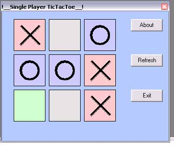



## \_\_\_Single Player TicTacToe\_\_\!

### Description

This is a Single Player TIC TAC TOE game, its wonderful to play with the computer, but its not finished yet, as i have limited time. My 2nd entry. Ur chances of winning are rear. Check out.

Please vote for me (Just to know my quality). Thank U. {:).All comments and sugestions are welcomed.
 
### More Info
 
I think it works best in 98. (XP also but slower!!!)why??

             |
---                |---
**Submitted On**   |2005-01-20 12:50:02
**By**             |[Arun P \{:\-\)](https://github.com/Planet-Source-Code/PSCIndex/blob/master/ByAuthor/arun-p.md)
**Level**          |Beginner
**User Rating**    |5.0 (10 globes from 2 users)
**Compatibility**  |VB 5\.0, VB 6\.0
**Category**       |[Games](https://github.com/Planet-Source-Code/PSCIndex/blob/master/ByCategory/games__1-38.md)
**World**          |[Visual Basic](https://github.com/Planet-Source-Code/PSCIndex/blob/master/ByWorld/visual-basic.md)
**Archive File**   |[\_\_\_Single\_1842181202005\.zip](https://github.com/Planet-Source-Code/arun-p-single-player-tictactoe__1-58395/archive/master.zip)

